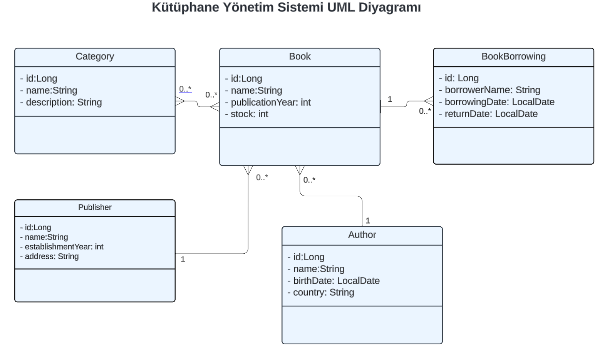
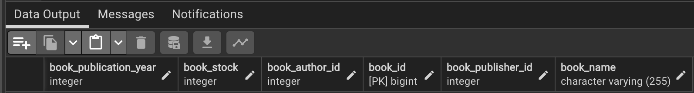
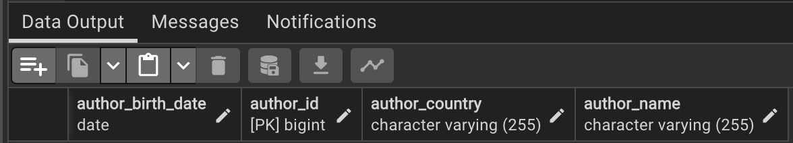
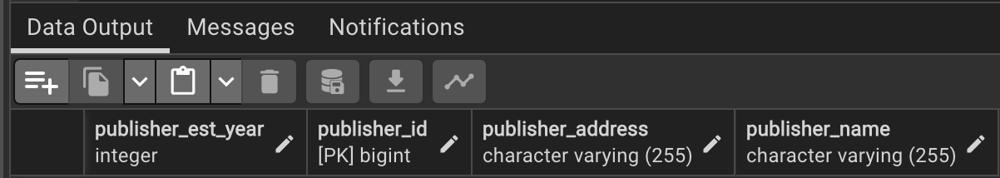
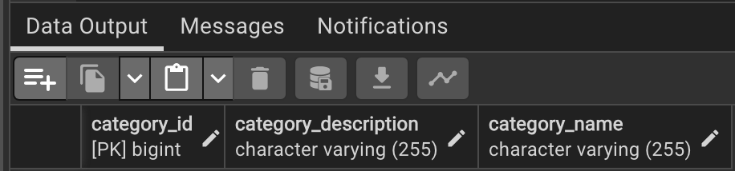
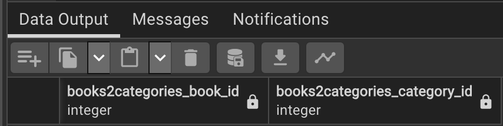
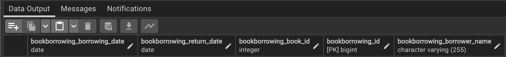

# Kütüphane Yönetim Sistemi

Bir kütüphane yönetim sistemi tasarlanmıştır. Bu kütüphane sisteminde aşağıdaki entity’ler bulunmaktadır.

Kitap : Kitapların özelliklerini içeren entity/tablo.

Yazar : Yazarların özelliklerini içeren entity/tablo.

Kategori : Kitap kategorilerini içeren entity/tablo.

Yayın Evi : Yayınevlerinin özelliklerini içeren entity/tablo.

Kitap Ödünç Alınması : Kitap ödünç alma işlemlerini izleyen entity/tablo. Bu tablo, ödünç alınan kitabın kim tarafından alındığını, alınma tarihini ve teslim tarihini içerir.

Oluşturulan tabloların görüntüleri aşağıda verilmiştir:

### books:

### authors:

### publishers:

### categories:

### books2categories

### bookborrowings

