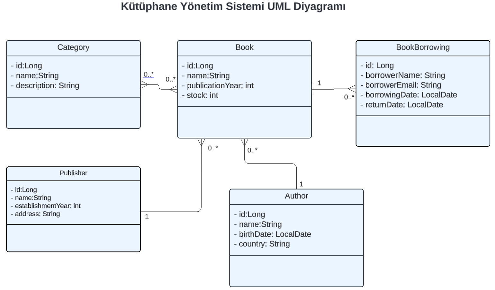

# Rest API Geliştirme

Bu projede CRUD operasyonları yapabilen rest API yazılmıştır.

Rest API geliştirmek için spring initializr’dan spring boot projesi açılmış ve gerekli dependency’ler tanımlanmıştır. 

Proje katmanlı mimari kullanılarak geliştirilmiştir.(Entity, repository, service ve controller katmanlarımız vardır).

IoC, DI kullanımında constructor injection’dan faydalanılmıştır.

Gerekli anotasyonlar (@Entity, @Table, @Id, @OneToMany, @ManyToOne, @ManyToMany) eklenmiştir.

Projede veritabanı sistemi olarak PostgreSQL kullanılmıştır.

Projeye ait tüm Endpointler aşağıdaki gibidir:

| HTTP Metodu | Endpoint       | Açıklama                  |
|-------------|----------------|---------------------------|
| GET         | /v1/books      | Tüm kitapları getirir     |  
| GET         | /v1/books/{id} | Belirli bir kitabı getirir |
| POST        | /v1/books      | Yeni bir kitap ekler      |
| PUT         | /v1/books      | Bir kitabı günceller      |
| DELETE      | /v1/books/{id} | Belirli bir kitabı siler  |

| HTTP Metodu | Endpoint         | Açıklama                   |
|-------------|------------------|----------------------------|
| GET         | /v1/authors      | Tüm yazarları getirir      |  
| GET         | /v1/authors/{id} | Belirli bir yazarı getirir |
| POST        | /v1/authors      | Yeni bir yazar ekler       |
| PUT         | /v1/authors      | Bir yazarı günceller       |
| DELETE      | /v1/authors/{id} | Belirli bir yazarı siler   |

| HTTP Metodu | Endpoint                | Açıklama                                |
|-------------|-------------------------|-----------------------------------------|
| GET         | /v1/bookborrowings      | Tüm ödünç alınan kitapları getirir      |  
| GET         | /v1/bookborrowings/{id} | Belirli bir ödünç alınan kitabı getirir |
| POST        | /v1/bookborrowings      | Yeni bir ödünç alınan kitap ekler       |
| PUT         | /v1/bookborrowings      | Bir ödünç alınan kitabı günceller       |
| DELETE      | /v1/bookborrowings/{id} | Belirli bir ödünç alınan kitabı siler   |

| HTTP Metodu | Endpoint            | Açıklama                     |
|-------------|---------------------|------------------------------|
| GET         | /v1/categories      | Tüm kategorileri getirir     |  
| GET         | /v1/categories/{id} | Belirli bir kategori getirir |
| POST        | /v1/categories      | Yeni bir kategori ekler      |
| PUT         | /v1/categories      | Bir kategoriyi günceller     |
| DELETE      | /v1/categories/{id} | Belirli bir kategoriyi siler |

| HTTP Metodu | Endpoint            | Açıklama                      |
|-------------|---------------------|-------------------------------|
| GET         | /v1/publishers      | Tüm yayıncıları getirir       |  
| GET         | /v1/publishers/{id} | Belirli bir yayıncıyı getirir |
| POST        | /v1/publishers      | Yeni bir yayıncı ekler        |
| PUT         | /v1/publishers      | Bir yayıncıyı günceller       |
| DELETE      | /v1/publishers/{id} | Belirli bir yayıncıyı siler   |
